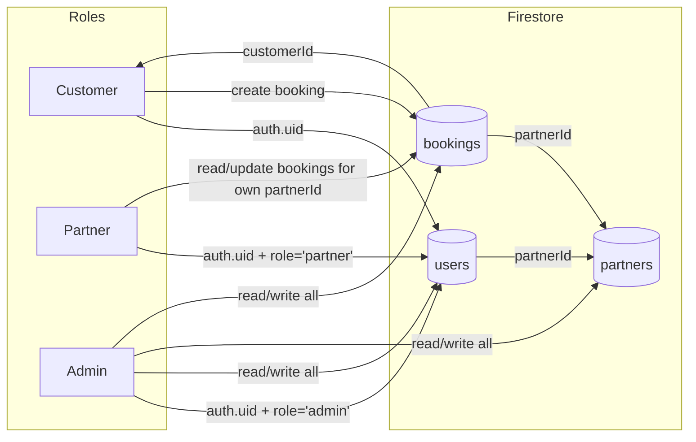

# Databasstruktur & Roller

```mermaid
flowchart LR
    subgraph Roles
        C[Customer]
        P[Partner]
        A[Admin]
    end

    subgraph Firestore
        U[(users)]
        R[(partners)]
        B[(bookings)]
    end

    C -->|auth.uid| U
    P -->|auth.uid + role='partner'| U
    A -->|auth.uid + role='admin'| U

    U -->|partnerId| R
    C -->|create booking| B
    B -->|customerId| C
    B -->|partnerId| R

    P -->|read/update bookings for own partnerId| B
    A -->|read/write all| U
    A -->|read/write all| R
    A -->|read/write all| B
```
